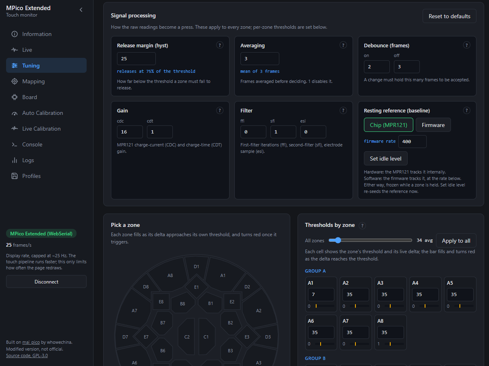
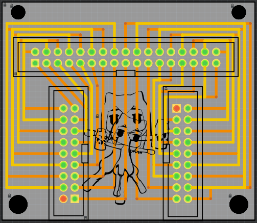
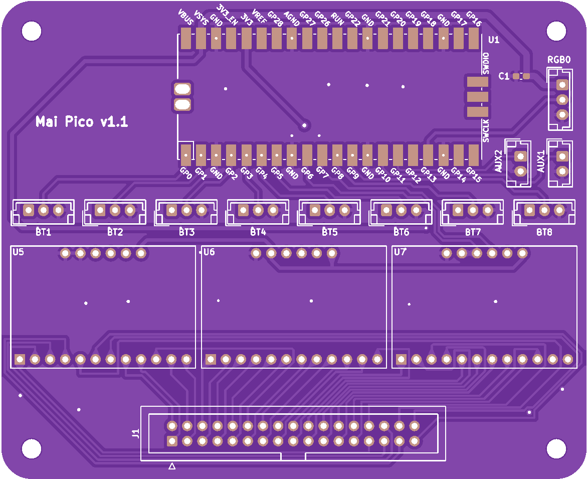

# mpico_extended

> [!IMPORTANT]
> ## Built on [mai_pico](https://github.com/whowechina/mai_pico) by whowechina
>
> The original firmware, the board design and the electronics are **their
> work**. This repository would not exist without it, and everything good here
> starts from what they built.
>
> ### ⭐ [Go star the original project](https://github.com/whowechina/mai_pico)
>
> This is **not** official, **not** a fork and **not** affiliated: it is a
> modified version, published under GPL-3.0 as the original licence requires.
> Base: [`e21fa23`](https://github.com/whowechina/mai_pico/commit/e21fa23) of
> `firmware/`, 27 August 2025.

An alternative firmware for **full-size** maimai-style controllers, with a web
monitor to calibrate and debug a panel from the browser instead of from a blind
serial console.

### → [Open the monitor](https://ouarss.github.io/mpico_extended/)

Chrome or Edge, nothing to install. Without a board connected it still opens,
so you can read the documentation and see what the tool does before flashing
anything.

> [!NOTE]
> **Personal note, so you know what you are getting.** This project has been
> heavily vibecoded. I understand the broad strokes of how it works, but not the
> fine details, so I may not be able to take it much further.
>
> I built it for myself and never planned to release it. I know what a hassle
> setting up a full ITO panel can be, and the results on mine are genuinely
> great: not a single misfire, and it reacts perfectly. That said, I am no pro.
>
> It may not work flawlessly for everyone. But it is heavily customisable, and
> at the very least you can use it to track down your own issues.


*Live view: what the board feels right now, zone by zone. A line drifting up
while nothing is touched is a zone picking up noise.*

## Why a separate project

mai_pico targets a compact, reduced-size controller.

We work here with a full-size DIY playfield, and that changes the physics:
bigger electrodes mean more surface, more parasitic capacitance, more crosstalk
between neighbours, and a signal several times weaker.

The stock firmware lets the MPR121 chip decide whether a zone is touched. That
suits small electrodes, but leaves too little control once the panel grows.

**This firmware moves the touch decision into the software.** It reads each
electrode's filtered value and its resting reference, then compares the delta
against that zone's own threshold, with hysteresis, averaging and debounce.

The decision is then a plain comparison on that delta:

```text
delta
   85            .------.
                 |      |
   40 --------- ON ------------- threshold ON: zone fires at 40
   30 ----------|------ OFF ---- threshold OFF: 40 x (1 - 25% hyst) = 30
    0 __________'        '______
        rest     press    release
```

Two things are easily confused, so to be explicit:

| Question | Answer |
|---|---|
| **Who decides** a zone is touched | Always the firmware. No switch back. |
| **Who tracks the resting reference** | A setting: the MPR121 by default, or the firmware at its own rate. Frozen while a zone is held either way. |

Because it changes such a core behaviour, this could not simply be merged
upstream, hence a separate repository rather than a pull request.

## The web monitor

**The part that makes a full-size panel possible to set up at all.** Tuning one
through a serial console means typing thresholds blind and guessing why a zone
misfires; this replaces that with something you can see and measure while the
board runs.

| Tab | What it does |
|---|---|
| **Live** | The board's current state, zone by zone, with traces, live threshold edits and the last real triggers. The place to debug anything. |
| **Auto Calibration** | A guided 5-step wizard: measures the noise floor, then press strength per zone, computes every threshold, verifies over 60 s, saves. |
| **Live Calibration** | Watches you play, spots near-misses (clean gestures that failed to trigger), suggests per-zone corrections. Experimental. |
| **Tuning** | Every setting, per zone, applied live, each with its own explanation. |
| **Mapping** | Which electrode feeds which zone, remappable by touching the panel. |
| **Logs** | Per-zone peak, noise ceiling and trigger counts, session recording, auto-save to disk as CSV/JSON. |
| **Profiles** | Named snapshots of the whole setup, exportable and importable. |
| **Console** | Raw CLI access for everything else. |

It runs at **[ouarss.github.io/mpico_extended](https://ouarss.github.io/mpico_extended/)**,
or straight from `monitor/index.html` in a local checkout. Both work the same;
the online one also gets the log auto-save, which a `file://` page cannot use.

It is original work, not derived from the upstream code, and talks to the board
over **WebSerial** (so: Chrome or Edge). Nothing is uploaded anywhere. No
account, no server, no telemetry: the page is served as static files and talks
only to your serial port.

Its **Information tab is the real documentation**: eleven articles covering the
hardware, how detection works, fighting false triggers, both calibration modes,
the logs, the profiles and the serial protocol. It sits next to the settings it
explains, with live values in view, which is why it is not duplicated here.



*Tuning: every knob of the software decision, each with its own explanation, and
per-zone thresholds whose bars fill as the live delta approaches them.*

### Auto-calibration, step by step

The wizard is the reason a full-size panel becomes workable in minutes. Getting
there without one took months: change a threshold, play a round, watch a zone
fire on its own anyway, change something else, and never actually see what the
panel was doing. No way to tell a noisy electrode from a badly mapped one from a
threshold set too low.

That is the problem this was built to end. It measures, decides, then proves the
result.


*Step 1 resets the board and settles the **global** settings: it analyses the
standby noise, tries parameter combinations, and keeps the one that measurably
lowers it. That baseline is what the next steps fine-tune zone by zone, and the
log shows it deciding: "max 17; clearly quieter - keeping avg 3".*


*Step 2 asks for a few taps per zone and counts **real presses**, not a timer.
If it detects the response on a different zone, you can remap that zone on the
fly, without leaving the wizard.*


*Step 4 applies the computed thresholds, then watches an untouched panel for a
full minute and counts every zone that fires by itself. Any false trigger raises
that zone and re-runs the pass, until it comes back clean.*

## Firmware changes

| Area | Change |
|---|---|
| Touch decision | Made in firmware from the filtered/baseline delta, not by the MPR121 comparator |
| Tuning | Absolute per-zone thresholds, hysteresis, moving average, debounce, gain, filter, baseline mode |
| I2C | Round-robin sensor reads, bounded timeouts, core0 kept at 1 kHz |
| CLI | `thr`, `hyst`, `avg`, `debounce`, `gain`, `baseline`, `rebase`, `preset`, richer `raw` |
| Machine stream | `feed` publishes live frames and the full configuration as JSON, which is what the monitor consumes |
| LEDs | Button-to-LED chain order is remappable |
| Fixes | Flash write no longer hardfaults via core1 XIP, USB/HID bounds checks, CLI prefix matching |

The `upstream-base` branch holds the unmodified upstream `firmware/` at the base
commit, so the exact scope is one command away:

```sh
git diff upstream-base..main
```

Line endings there were normalised to LF to match this repository, so the diff
shows real changes only.

## Building

Requirements:

- a Unix shell (WSL or MSYS2/Git Bash), since the CMake build calls `cp` and `touch`
- [Pico SDK](https://github.com/raspberrypi/pico-sdk), via `PICO_SDK_PATH`
- `arm-none-eabi-gcc`, `cmake`, and `ninja` or `make`
- a host compiler (gcc/clang/cl) to build `pioasm` and `picotool`

`aic_pico` is **not** vendored here, fetch it at the pinned revision:

```sh
git clone https://github.com/whowechina/aic_pico modules/aic_pico
git -C modules/aic_pico checkout 5a0dbc9d132218c67f2a3b500e4251c96fcaf2df
```

Then:

```sh
export PICO_SDK_PATH=$HOME/pico/pico-sdk
./build.sh
```

The result is `mpico_extended.uf2` at the repository root.

## Flashing

Hold **BOOTSEL** while plugging the USB cable, then drop the `.uf2` on the
`RPI-RP2` drive that appears. Coming from another firmware? Run `factory` once
in the CLI, then open the
[monitor](https://ouarss.github.io/mpico_extended/) and run the
auto-calibration wizard: thresholds are specific to your panel and do not carry
over from someone else's.

Prebuilt binaries are attached to the
[releases](https://github.com/ouarss/mpico_extended/releases).

The USB vendor and product ids are deliberately unchanged (`0ca3`/`0021`), since
the game and existing tools identify the board by them. Product and interface
names do carry this firmware's identity, so a board running it is never mistaken
for a stock one.

## The build this was written for

Everything physical behind the firmware sits in `custom-build/`: the panel it
was tuned on, the boards it talks to, and the templates its electrodes were cut
from. It is published as it exists, not as a kit: no bill of materials, no
step-by-step, no support. A full-size panel is hard enough to source that a
working reference beats nothing at all.

Same rule as the rest: **non-commercial**. Build one for yourself, don't sell
it.


*The panel this firmware was written against: a full-size ITO playfield, every
zone tapped at the rim, every tap running back to a single connector.*

### `Build pictures/` — what it looks like assembled

| At the rim | Under the panel |
|---|---|
|  |  |
| *`one-connector-to-rules-them-all.jpg`: every zone tap arrives on one small board, two flat cables in, a single ribbon out.* | *`mai_pico-panel-connexion.jpg`: the other end of that ribbon, on the Pico board, with the three sensor modules above it.* |

### `Fullbody Shield/` — the metal front panel

The full-body front panel, vectorised and ready to cut, as `.ai` and `.dxf`
with a `.png` preview. It carries the screen opening, the playfield circle and
every button and LED hole.

Folding, per its `readme.txt`: 40 mm flange, 75° on top, 90° on both sides. It
started from my Wacca panel, so the outer profile is specific to that cabinet.

| Flat, as cut | Folded |
|---|---|
|  |  |
| *`mai-shield-v3.png`, the preview of the `.dxf`: screen opening, playfield circle, and every button and LED hole.* | *`fold reference.jpg`: which edge folds where, and at what angle.* |

### `Pattern templates/` — cutting the ITO zones


*`pattern.jpg`, the layout in one view: every zone, and the trace that carries
it out to the rim where the flat cables pick it up.*

Two ways to transfer it onto the film:

| Folder | What it is | Print with |
|---|---|---|
| `Circle template/` | Six A4 sheets forming the complete circle | fit image to frame **on** |
| `Cut templates/` | The same zones laid out flat over two sheets | fit to frame **off** |

Those settings are not interchangeable, and the scale the printer applies is the
only thing that matters here, so each folder carries the screenshot of its own:

| `Circle template/checked.png` | `Cut templates/no-check.png` |
|---|---|
|  |  |
| *Ticked, for the six circle sheets.* | *Unticked, for the two pattern sheets.* |

### `PCBs/` — three boards

| Board | What it does |
|---|---|
| `glass-pcb` | The small board at the panel rim: the flat cables coming off the ITO film land there and leave as that one ribbon |
| `837-15257-01_IO4-extension` | A breakout for the Sega IO4 (`837-15257-01`): its 60-pin and 20-pin IDC in, JST out for test/service/coin, 1P/2P buttons and select, card-reader and camera LEDs, the 12 V billboard RGB, plus 5 V/12 V distribution |
| `mai_pico-custom-output` | mai_pico v1.1 with the panel output reworked into a single ribbon header, next to the Pico, the eight button connectors and the three sensor modules |

| `glass-pcb` | `mai_pico-custom-output` |
|---|---|
|  |  |
| *What the photo above shows in the flesh.* | *The output section is the ribbon header at the bottom.* |


*`837-15257-01_IO4-extension`: the IO4's two IDC connectors in, everything a
cabinet actually needs to plug into out.*

The first two ship as a preview `.png` and a `.zip` of Gerbers, ready to upload
to JLCPCB or an equivalent.

The third ships as a picture only, deliberately. It is upstream's board with
the output reworked, so the design is whowechina's and so is the right to hand
out a production-ready file for it. The picture shows what changed; the board
itself is theirs, and that is where to get it.

### `Plan/` — the cabinet


`mai-plan.png`, drawn rough and kept that way: a cut list of every panel with
its thickness, a front view and a side profile with its angles. Enough to walk
into a workshop with, and nothing more: it is not CAD, and nothing in it has
been checked twice.

## Licences

| Part | Licence |
|---|---|
| This firmware and the upstream code it derives from (`src/`) | **GPL-3.0**, see `LICENSE` |
| `monitor/` (original work) | GPL-3.0, as part of this repository |
| `aic_pico`, linked at build time | CC BY-NC 4.0, upstream |
| `pico_sdk_import.cmake` (copied from the Pico SDK) and `src/tusb_config.h` / `src/usb_descriptors.c` (TinyUSB-derived) | BSD-3-Clause / MIT, notices kept in the files |
| `custom-build/` (photos, panel, cutting templates, cabinet plan, `glass-pcb`, IO4 extension) | Original work, **non-commercial** |
| Upstream hardware (PCB, CAD, docs), which the `mai_pico-custom-output` preview derives from | CC BY-NC 4.0, upstream |

Two points worth stating plainly:

- **The firmware side is GPL.** Upstream licenses its `firmware/` under GPL-3.0
  and its hardware under CC BY-NC 4.0. This repository only derives from the
  firmware, so GPL-3.0 applies and the source is published here as required.
- **`aic_pico` is not.** It carries no separate licence for its firmware
  directory, so its root CC BY-NC 4.0 applies, which is not GPL-compatible. That
  inconsistency is upstream's and cannot be resolved here, so treat the built
  binary as **non-commercial**: do not sell it, or anything built from it.

Nobody involved is making money from this, and nobody should.
